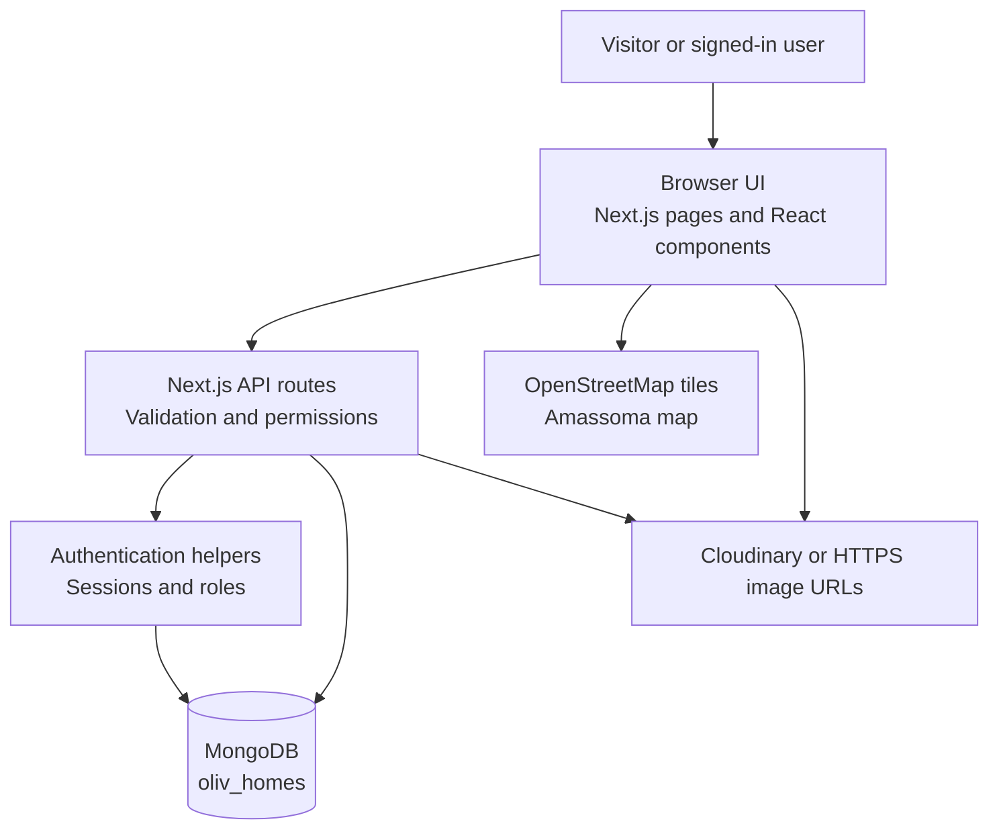
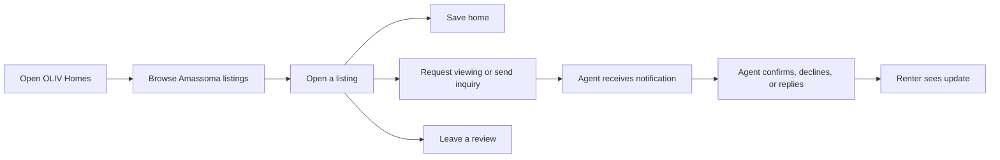
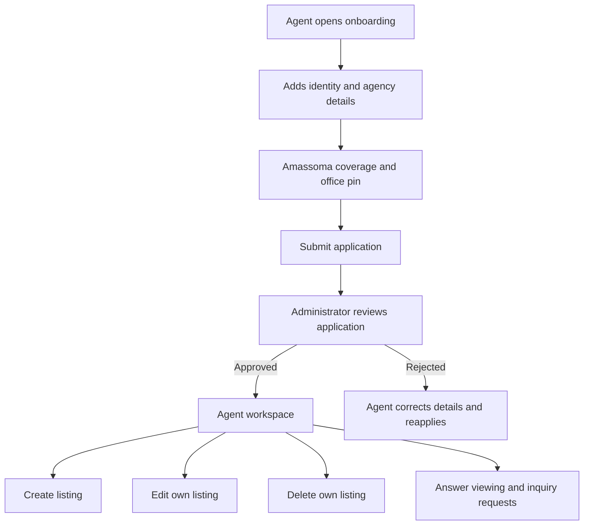
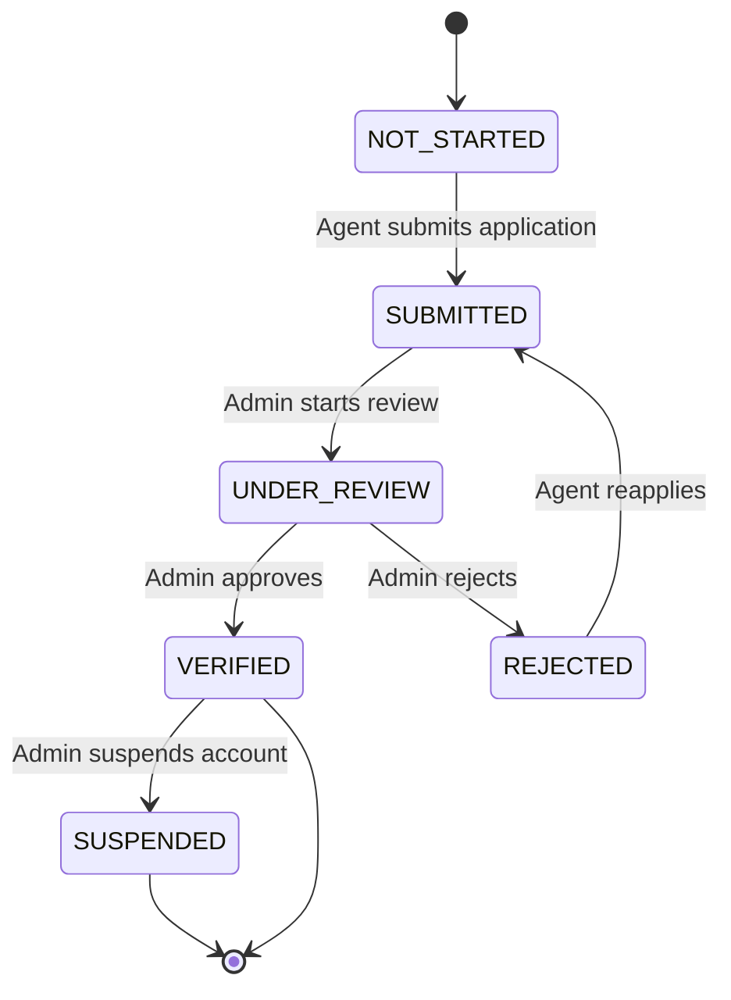
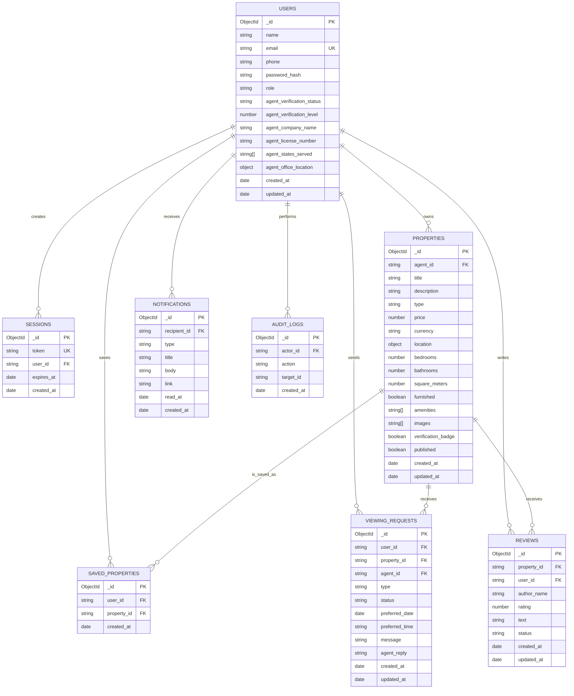
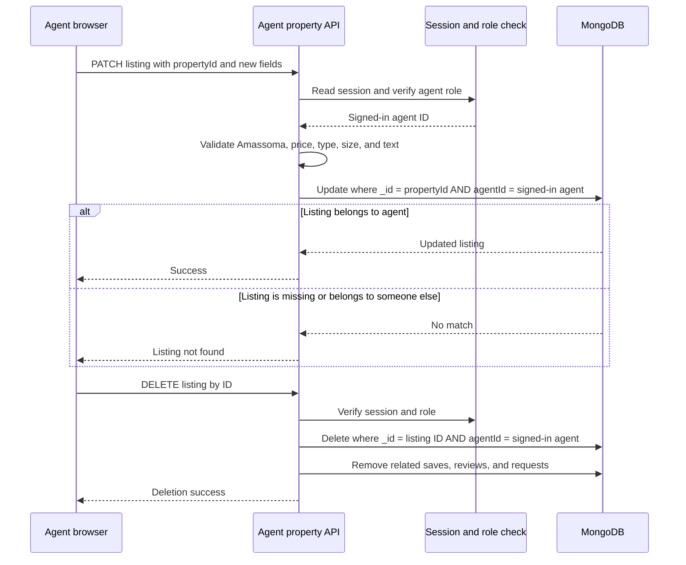
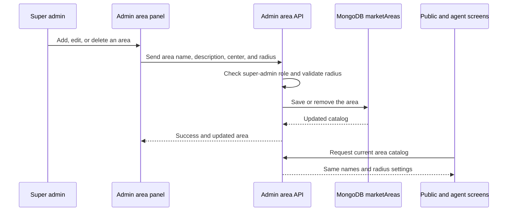

# OLIV Homes Project Guide

## 1. What OLIV Homes is

OLIV Homes is a property marketplace for **Amassoma, Bayelsa, Nigeria**.

People looking for a home can:

- Browse available homes.
- Search the Amassoma listings.
- View a property on a map.
- Save a home for later.
- Ask for a viewing.
- Send an inquiry to the agent.
- Leave a review.

Agents can apply to list homes. Once an administrator verifies an agent, that agent can create, edit, and delete their own listings and reply to renter requests.

The application is intentionally local. It is not currently a nationwide marketplace. New public listings and new agent listings must use **Amassoma** as the city.

## 2. Important words in simple terms

| Word | Meaning |
|---|---|
| Renter | A normal user looking for a home. In the code, this is the `USER` role. |
| Agent | A property professional who lists homes and handles requests. |
| Administrator | A trusted person who reviews agents and manages the platform. |
| Listing | One property advertisement. |
| Viewing request | A request from a renter to visit a property. |
| Inquiry | A message from a renter to an agent. |
| Session | The secure record that keeps a signed-in user logged in. |
| Seed data | Sample users and listings inserted for development. |

## 3. Main product rules

1. The marketplace location is Amassoma, Bayelsa.
2. The map opens around Amassoma using these coordinates:
   - Latitude: `4.9730872`
   - Longitude: `6.1089697`
3. Public property searches only return published Amassoma listings.
4. Agents must be verified before they can publish listings.
5. An agent can edit or delete only their own listings.
6. Deleting a listing also removes its saved-property records, reviews, and viewing requests.
7. Dark mode is the default. A visitor can switch to light mode with the header button.
8. People can filter listings by named Amassoma micro-markets. The selected micro-market is shown as a radius on the map.

### Recommended Amassoma house categories

These are the shared categories used by the homepage, discovery page, agent workspace, API, and database:

| Category | What it means |
|---|---|
| Single Room | One room, usually with shared toilet or kitchen facilities. |
| Self-Contain | One room with a private toilet/bathroom and usually a small kitchenette or space. |
| Room & Parlour Self-Contain | Bedroom, private sitting room, and private toilet/bathroom. |
| 1 Bedroom Flat | Bedroom, living room, kitchen, and bathroom/toilet. |
| 2 Bedroom Flat | Two bedrooms, living room, kitchen, and bathroom/toilet. |
| 3 Bedroom Flat | Three bedrooms, living room, kitchen, and bathroom/toilet. |
| 4+ Bedroom Flat/House | Larger family or group accommodation. |
| Duplex | Multi-floor residential house. |
| Bungalow | Single-floor standalone house. |
| Shared Apartment | Multiple tenants sharing a flat or house. |
| Hostel | Student-focused accommodation, usually with multiple rooms or beds. |
| Lodge | Student or young-person accommodation; private or shared. |
| BQ / Boys' Quarters | Separate smaller unit attached to or behind a main house. |
| Furnished Apartment | Apartment already equipped with furniture or appliances. |
| Short-Let | Temporary accommodation rented for days, weeks, or months. |

## 4. Technology used

| Part | Technology | What it does |
|---|---|---|
| Web application | Next.js 16 | Displays pages and runs server API routes. |
| User interface | React 19 | Builds interactive screens and forms. |
| Language | TypeScript | Makes the code safer by checking data shapes. |
| Styling | Tailwind CSS and `app/globals.css` | Controls layout, colors, spacing, and dark mode. |
| Database | MongoDB | Stores users, listings, requests, reviews, and other records. |
| Maps | React Leaflet and OpenStreetMap tiles | Shows Amassoma maps and listing pins. |
| Images | Cloudinary upload route plus HTTPS image URLs | Stores and displays listing photos. |
| Hosting-ready analytics | Vercel Analytics | Runs only in production. |

## 5. How the system is arranged

The browser is the part the user sees. It talks to Next.js. Next.js decides whether a request is allowed, validates the data, and talks to MongoDB.



### What each layer means

**Browser UI** contains the screens and buttons. It makes the experience friendly, but it must not be trusted for security.

**API routes** are the guarded doors into the application. They check the signed-in user, role, ownership, input values, and Amassoma rules.

**Authentication helpers** read the session cookie and find the matching user in MongoDB.

**MongoDB** stores the lasting information. The application creates collections when they are first used.

**Map services** provide map images. OLIV supplies the Amassoma center and listing coordinates.

## 6. Project folders

```text
app/
  page.tsx                  Home page
  discover/page.tsx         Search and map discovery
  listing/[id]/page.tsx     One listing page
  login/page.tsx            Sign in
  signup/page.tsx           Create account
  profile/page.tsx          Saved homes and requests
  agent/onboarding/page.tsx Agent application
  agent/dashboard/page.tsx  Agent workspace
  admin/page.tsx            Admin workspace
  api/                      Server API routes
components/
  oliv-home.tsx             Home page UI
  oliv-map.tsx              Leaflet maps and location picker
  oliv-pages.tsx            Shared pages, forms, header, dashboard
lib/
  oliv-data.ts              Shared market settings and display helpers
  oliv-db.ts                MongoDB queries and write operations
  oliv-auth.ts              Current-user and session helpers
  oliv-client-state.tsx     Browser state and API refresh logic
  types.ts                  Main TypeScript data models
scripts/
  seed.mjs                  Resets and seeds development data
docs/
  oliv-homes.md             This guide
```

## 7. Main pages and user journeys

| URL | Purpose |
|---|---|
| `/` | Introduces OLIV Homes and links to Amassoma listings. |
| `/discover` | Shows published listings in list or map mode. |
| `/listing/[id]` | Shows photos, price, facts, map, reviews, and request actions. |
| `/login` | Signs a user into an existing account. |
| `/signup` | Creates a normal user account. |
| `/profile` | Shows saved homes, viewing requests, inquiries, and notifications. |
| `/agent/onboarding` | Collects an agent application. Coverage is fixed to Amassoma. |
| `/agent/dashboard` | Lets a verified agent manage listings and renter requests. |
| `/admin` | Lets a super admin review agents and platform activity. |

### Renter journey



### Agent journey



## 8. Authentication and permissions

Users sign in with an email and password. The password is salted and hashed before it is stored. The browser receives an opaque, `httpOnly` session cookie. The cookie contains no readable password.

The server checks permissions for every protected operation. A button being hidden in the browser is not considered security.

| Role | Allowed actions |
|---|---|
| `USER` | Browse, save homes, request viewings, send inquiries, and write reviews. |
| `AGENT` with `VERIFIED` status | Create, edit, delete owned listings and answer requests. |
| `AGENT` not yet verified | Apply and view onboarding status, but cannot publish listings. |
| `SUPER_ADMIN` | Review agent applications and perform platform administration. |

Super admins also manage the Amassoma micro-market catalog. From `/admin`, they can add an area, change its name or description, click directly on the live map to move its center point, type exact latitude and longitude values, adjust a live radius slider, type the radius in metres, or delete the area. The saved catalog is shared by public discovery, listing detail maps, agent listing forms, and the agent workspace.

### Agent verification states



## 9. Database design

MongoDB is a document database. Unlike a spreadsheet, it does not require every document to have exactly the same fields. OLIV still follows consistent shapes so that the application remains understandable.

### Entity relationship diagram

The arrows show logical relationships. MongoDB stores IDs in documents rather than using traditional SQL foreign-key constraints.



### Collection details

#### `users`

Stores renters, agents, and administrators. Agent-specific fields are kept on the same user document because an agent begins as a normal account and later receives verification information.

Important fields:

- `role`: `USER`, `AGENT`, or `SUPER_ADMIN`.
- `agentVerificationStatus`: `NOT_STARTED`, `SUBMITTED`, `UNDER_REVIEW`, `VERIFIED`, `REJECTED`, or `SUSPENDED`.
- `agentOfficeLocation`: the agent's optional map pin.
- `agentStatesServed`: retained for the account model, but current onboarding coverage is Amassoma/Bayelsa only.

#### `properties`

Stores each listing. The `agentId` connects the listing to its owner. The `location` object contains the Amassoma address and optional latitude/longitude.

Important fields:

- `published`: controls whether the public catalog can show the listing.
- `price`: yearly rent in the current user interface.
- `images`: HTTPS image URLs.
- `coordinates`: the exact map point when the agent pins one.
- `area`: the selected Amassoma micro-market, such as `CHS Area` or `Mango Street`.

### Amassoma micro-markets

The location filter uses a fixed shared catalog so that renters, agents, maps, seed data, and documentation use the same names:

| Area | Simple description |
|---|---|
| CHS Area | College of Health Sciences and CHS Boys Hostels; a high-demand medical and clinical-student zone. |
| Main Gate Axis | Properties immediately around the main university entrance. |
| Tantua / Tantua Road | Premium neighbourhood opposite the late DSP Alamieyeseigha Estate. |
| Mango Street | Student lodges known for stronger water infrastructure. |
| Mango Street Junction | Busy commercial and transport strip leading into Mango Street. |
| Ogbopina | Student-heavy area with shops and viewing centres. |
| Abenikiri (Ibenikiri) | Populated and calmer residential settlement. |
| Okori-Ama | Fast-growing student community with competitive land activity. |
| Agbedi-Ama | Densely populated and budget-friendly student housing area. |
| Efeke-Ama | Historic royal quarter with lodges and family compounds. |
| Ogoun-Ama | Expanding outer zone with new lodge construction. |

The catalog stores an approximate center and radius for each area. These are discovery boundaries, not legal property boundaries or land surveys. The supplied local-market notes identify CHS as a particularly important student and medical-campus hub.

#### `sessions`

Stores login sessions. A session has an expiration date. Logging out deletes the session and clears the browser cookie.

#### `savedProperties`

Connects a user to a property they saved. It is a small relationship collection rather than a large array inside the user document.

#### `viewingRequests`

Stores both viewing requests and inquiries. The `type` field distinguishes `VIEWING` from `INQUIRY`. The `status` field records the progress.

#### `reviews`

Stores ratings and comments. Public pages show published reviews. A review may also be pending or reported for moderation.

#### `notifications`

Stores the in-app notification bell items. Notifications can link back to a listing, request, profile, or admin page.

#### `auditLogs`

Stores important administrative actions such as submitting or approving an agent application.

## 10. Listing create, edit, and delete design

The agent property API uses these operations:

| Method | URL | Purpose |
|---|---|---|
| `GET` | `/api/agent/properties` | List the signed-in agent's properties. |
| `POST` | `/api/agent/properties` | Create a property after validation. |
| `PATCH` | `/api/agent/properties` | Edit a property when `propertyId` is supplied. |
| `DELETE` | `/api/agent/properties?id=...` | Delete an owned property. |

For edits and deletes, the database query includes both the listing ID and the signed-in user's ID. This prevents Agent A from changing Agent B's listing even if Agent A guesses the listing ID.



## 11. API reference

### Authentication

| Method | Route | Description |
|---|---|---|
| `GET` | `/api/auth` | Check the current signed-in user. |
| `POST` | `/api/auth` | Sign in or create an account, depending on the request body. |
| `DELETE` | `/api/auth` | Log out and remove the session. |

### Public marketplace

| Method | Route | Description |
|---|---|---|
| `GET` | `/api/properties` | Get published Amassoma listings. Supports search, area, city, type, page, and limit. |
| `GET` | `/api/reviews` | Get visible reviews. |
| `POST` | `/api/reviews` | Submit a signed-in user's review. |
| `GET` | `/api/favorites` | Get the signed-in user's saved homes. |
| `POST` | `/api/favorites` | Save or unsave a home. |
| `GET` | `/api/requests` | Get the signed-in user's requests. |
| `POST` | `/api/requests` | Create a viewing request or inquiry. |

### Agent and administration

| Method | Route | Description |
|---|---|---|
| `GET/POST` | `/api/agent/onboarding` | Read or submit an agent application. |
| `GET/PATCH` | `/api/agent/profile` | Read or update an agent profile. |
| `GET/POST/PATCH/DELETE` | `/api/agent/properties` | List, create, edit, or delete agent-owned listings. |
| `GET` | `/api/agent/overview` | Load agent metrics and workspace data. |
| `GET/PATCH` | `/api/agent/requests` | Read and answer renter requests. |
| `GET` | `/api/agent/reviews` | Read reviews for the agent's listings. |
| `GET/PATCH` | `/api/admin/verification` | Review and update agent verification. |
| `GET` | `/api/areas` | Read the current public Amassoma area catalog. |
| `GET/POST/PATCH/DELETE` | `/api/admin/areas` | Read or manage areas and radius settings as a super admin. |

## 12. Local setup for a non-developer

### What you need

- Node.js installed.
- A MongoDB connection string.
- The project folder opened in a terminal.

### First setup

1. Create a file named `.env` in the project root.
2. Add the database values:

   ```env
   MONGODB_URI="your-mongodb-connection-string"
   MONGODB_DB="oliv_homes"
   ```

3. Install the project packages:

   ```bash
   npm install
   ```

4. Reset the development database and load sample data:

   ```bash
   npm run seed
   ```

   **Warning:** the seed script drops the configured database first. Use it only with a development database. It creates three sample Amassoma listings and development accounts.

5. Start the website:

   ```bash
   npm run dev
   ```

6. Open `http://localhost:3000` in a browser.

### Development accounts

| Role | Email | Password | Main use |
|---|---|---|---|
| Renter | `user@olivhomes.ng` | `OlivUser2026!` | Browse and request viewings. |
| Agent | `agent@olivhomes.ng` | `OlivAgent2026!` | Test the verified agent workspace. |
| Admin | `admin@olivhomes.ng` | `OlivAdmin2026!` | Review agent applications. |

These accounts are for local development only. Change the passwords before any real deployment.

## 13. Seeding data

The script is `scripts/seed.mjs`. It:

1. Reads `.env`.
2. Connects to `MONGODB_URI`.
3. Drops the selected database.
4. Creates three users.
5. Creates realistic Amassoma listings:
   - Amassoma Riverside Court.
   - NDU Road Family Home.
   - Scholars Lodge Amassoma.
6. Adds sample reviews.
7. Closes the database connection.

Never run this script against a production database unless deleting all production data is genuinely intended.

## 14. Maps and location data

Maps use Leaflet in the browser and OpenStreetMap tiles. The shared market configuration lives in `lib/oliv-data.ts`.

The map can:

- Open at Amassoma automatically.
- Show listing pins.
- Show one listing in detail.
- Let an agent search for or click an office/listing location.
- Reverse-geocode a clicked point into an address, town, and state.
- Draw the selected micro-market as a visible radius circle.
- Show the saved listing area radius on listing detail maps.
- Show the chosen area radius while an agent pins a listing location.

The same zone catalog powers the discovery filter, public maps, agent listing form, agent workspace labels, API validation, and seed data. This prevents a renter seeing one spelling while an agent sees another.

### Area administration flow



Map location is helpful but should not be treated as a legal boundary or property survey. Listing addresses and coordinates should be checked by the agent before publishing.

### Map data limitation

Map coverage and place-name data for Amassoma are not as complete or precise as map data for larger cities. Some roads, hostels, junctions, compounds, and local landmarks may be missing, have a different spelling, or appear in a slightly different position. This can make map navigation and search more difficult, especially around student areas and newer developments.

The area circles in OLIV are therefore **approximate discovery guides**, not official boundaries. A circle helps people search around a known micro-market, but it does not prove that a property is inside a neighbourhood or show the exact route to a building. A map pin can also be less accurate when the mapping service has limited local information.

Agents should confirm the written address, nearest landmark, access road, and map pin with local knowledge before publishing. Renters should contact the agent for directions when a route, road name, or landmark is unclear. OLIV should not be used as the only source for travel directions, surveying, land ownership, emergency response, or legal property boundaries.

## 15. Dark mode

Dark mode is the default because the root HTML element starts with the `dark` class. The header button changes between dark and light mode.

The selected preference is saved in browser `localStorage` under `oliv-theme`:

- `dark`: use dark mode.
- `light`: use light mode.
- No saved value: use dark mode.

Colors are defined as CSS variables in `app/globals.css`. Components should use semantic classes such as `bg-background`, `bg-card`, `text-foreground`, `text-muted-foreground`, and `border-border` instead of hard-coded white or black colors.

## 16. Safety and production checklist

Before launch:

- Use a separate production MongoDB database.
- Rotate all development passwords.
- Rotate the database password if it has ever been shared or committed.
- Make sure `.env` is ignored by Git and never exposed to the browser.
- Use HTTPS and secure cookies in production.
- Add rate limits to login, signup, reviews, inquiries, and agent applications.
- Add email or phone verification before approving real agents.
- Add image type, image size, and upload abuse limits.
- Back up MongoDB and test restoring a backup.
- Add privacy, terms, contact, and reporting pages.
- Add monitoring for failed API calls and database failures.
- Review destructive actions such as database seeding and listing deletion.
- Test permissions with two different agent accounts.

## 17. Useful checks

Check TypeScript:

```bash
npm exec tsc -- --noEmit
```

Check the seed script without connecting to MongoDB:

```bash
node --check scripts/seed.mjs
```

Check for whitespace problems before committing:

```bash
git diff --check
```

## 18. Future improvements

- Add automated browser tests for renter, agent, and admin journeys.
- Add pagination or infinite scrolling for larger listing catalogs.
- Add server-side image optimization and moderation.
- Add a proper audit log viewer for administrators.
- Add map-radius filtering around Amassoma.
- Add email notifications in addition to in-app notifications.
- Add a separate `inquiries` collection if inquiry workflows become more complex than the shared request model.
- Add database migrations if document shapes change significantly.
